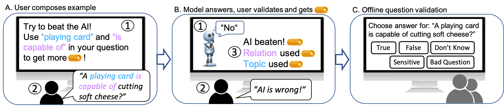

# CommonsenseQA 2.0: Exposing the limits of AI through Gamification

CommonsenseQA is a yes/no question answering challange set which was collected using a game called ["Teach-Your-AI"](https://teach-your-ai.apps.allenai.org/)

<center>
    <a href="https://allenai.github.io/csqa2/figures/intro.png"> 
        
      </a>
</center>

At a high-level, a player is asked to author a yes/no question, is then shown the answer from the AI, and then marks whether the AI was correct or not. The goal of the player is to earn points, which are used as a flexible vehicle for steering the behaviour of the player. First, points are given for beating the AI, that is, authoring questions where the AI is incorrect. This incentivizes the player to ask difficult questions, conditioned on its understanding of the AI capabilities. Second, the player gets points for using particular phrases in the question. This provides the game designer control to skew the distribution of questions towards topics or other phenomena they are interested in. Last, questions are validated by humans, and points are deducted for questions that do not pass validation. This pushes players to author questions with broad agreement among people. 

For more details check out our NeurIPS-21 benchmark submission
 ["CommonsenseQA 2.0: Exposing the Limits of AI through Gamification"](https://openreview.net/forum?id=qF7FlUT5dxa&referrer=%5BAuthor%20Console%5D(%2Fgroup%3Fid%3DNeurIPS.cc%2F2021%2FTrack%2FDatasets_and_Benchmarks%2FRound1%2FAuthors%23your-submissions)),
and [website](https://allenai.github.io/csqa2/).

### Changelog

- `07/06/2021` Version 2.01 is out.

# CommonsenseQA 2.0 Dataset

In the [dataset](https://github.com/allenai/csqa2/tree/master/dataset) contains all dataset files:

1) `CSQA2_train.jsonl.gz` - all training examples
2) `CSQA2_dev.jsonl.gz` - all development set examples
3) `CSQA2_test_no_answers.jsonl.gz` - all test set examples without answer or validations

## Dataset Format

The dataset is provided in [jsonl](https://jsonlines.org/) format such that each line is a single example with the following format.

```json
{
 "id": "Unique identifier for the example (5454c14ad01e722c2619b66778daa98b)",
 "question": "Natural language question or assertion to which the answer is yes or no (for assertions: yes is considered true, and no is considered false)",
 "answer": [
  "answer1",
  "answer2"
 ],
 "confidence": "A number between 0 and 1.0 related to the quality of the question as produced by the Automatic question verification model (see section 2.2 in the main paper)",
 "relational_prompt": "The relational prompt as displayed to the player (see section 2.1 in the main paper for details)",
 "relational_prompt_used": "True/False, indicates whether the composing player has chosen to use the relational prompt",
 "topic_prompt": "The topic prompt as displayed to the player (see section 2.1 in the main paper for details)",
 "topic_prompt_used": "True/False, indicates whether the composing player has chosen to use the topic prompt",
 "validations" : ["yes", "no", "bad question", "sensitive", "(A list of player validations for the question that can take the values)"] 
}
```

## Supplementary Material

The [supplementary material document](https://github.com/allenai/csqa2/tree/master/supplementary_material/CSQA2_SupplementaryMaterial.pdf) provides additional information about the Dataset, the Data Collection through Gamification, Dataset Analysis, the Experimental Evaluation, and the Model Analysis. The [supplementary material zipfile](https://github.com/allenai/csqa2/tree/master/supplementary_material/CSQA2_SupplementaryMaterial.zip) contains GPT3 predictions as well as contrast set and qualitative reasoning skills information. 
